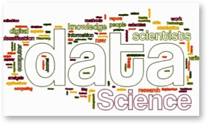

Learning from data in order to gain useful predictions and insights. This course introduces methods for five key facets of an investigation: data wrangling, cleaning, and sampling to get a suitable data set; data management to be able to access big data quickly and reliably; exploratory data analysis to generate hypotheses and intuition; prediction based on statistical methods such as regression and classification; and communication of results through visualization, stories, and interpretable summaries. 

We will be using Python for all programming assignments and projects. All [lectures will be posted here](http://cm.dce.harvard.edu/2015/01/14328/publicationListing.shtml) and should be available 24 hours after meeting time.

The course is also listed as AC209, STAT121, and E-109. 

#### Instructors

* Rafael Irizarry, Biostatistics
* Verena Kaynig-Fittkau, Computer Science

#### Staff

* Stephanie Hicks, Head TF
* Mingxiang Teng
* Michael Packer
* Marcus Way
* Michael Lackner
* Amy Mir
* Tarik Adnan Moon
* Olivia Angiuli
* Yang Li
* Huihui Fan
* Antonia Oprescu
* Claudio Rosenberg
* Tudor Giurgica-Tiron
* Zhijie Zhou
* Nural Zaman
* Brian Feeny
* Joy Ming
* Rick Lee
* Felix Gonda
* Korey Tucker
* Lane Erickson
* Diana Miao
* Logan Kerr
* Stephen Klosterman

#### Lectures and Labs

* Lectures are 2:30-4pm on Tuesdays & Thursdays in Northwest B103
* Labs are 10am-12pm on Fridays, Room TBA

#### Material from CS 109 taught in Fall 2013

* [Videos](http://cm.dce.harvard.edu/2014/01/14328/publicationListing.shtml)
* [Slides](https://drive.google.com/folderview?id=0BxYkKyLxfsNVd0xicUVDS1dIS0k&usp=sharing)
* [Homework, labs and solutions](https://github.com/cs109/content)
